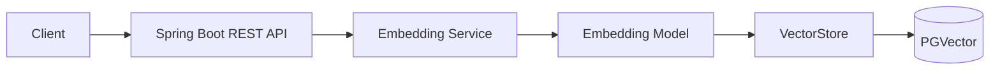
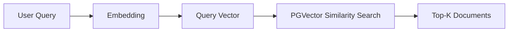

# AI Engineering Lab

A hands-on lab for becoming an **AI Application / AI Backend Engineer** on a Java + Spring Boot foundation.
The focus is *using* existing AI models from well-engineered backends: embeddings, vector databases, RAG, tool calling,
agents, MCP, memory, security, observability. No model training and no ML research.

## Current milestone: 1. Embeddings → pgvector → semantic search





Working state: **Spring Boot 4.1 → Spring AI 2.0 → all-MiniLM-L6-v2 (384-d) → PostgreSQL 17 + pgvector 0.8.7 → semantic search.**
The LLM is intentionally absent. See [why](01-embeddings/notes/developer-notes.md#why-is-the-llm-intentionally-absent-at-this-stage).

## Roadmap

| # | Milestone | Status |
|---|-----------|--------|
| 1 | Embeddings → pgvector → semantic search (no LLM) | **done** |
| 2 | Same dataset and experiment on Chroma, Qdrant, Redis: "what changes when the vector DB changes?" | planned |
| 3 | RAG: chunking, retrieval tuning, LLM answer generation with sources | planned |
| 4 | Tool calling and agents | planned |
| 5 | MCP | planned |

## Quick start

Prerequisites: **Java 21**, **Docker** (with Compose v2), **Git**. Maven is not required (wrapper included). No API key is needed.

```bash
git clone https://github.com/ARGOD2213/ai-engineering-lab.git
cd ai-engineering-lab

# 1. Configuration (git-ignored). Set POSTGRES_PASSWORD to any value.
cp .env.example .env

# 2. PostgreSQL + pgvector
docker compose up -d
docker compose ps                                     # wait for "(healthy)"
./infrastructure/docker/postgres/verify-pgvector.sh   # prints "pgvector OK"

# 3. The service (first start downloads the ~90 MB embedding model)
cd services/ai-engineering-api
./mvnw spring-boot:run                                # Windows: mvnw.cmd spring-boot:run
```

In a second terminal, from the repository root:

```bash
# Text → vector
curl -s -X POST localhost:8080/api/embeddings -H 'Content-Type: application/json' \
  -d '{"text": "Employees are entitled to 12 casual leave days per year."}'

# Same meaning vs. different meaning
./01-embeddings/experiments/semantic-similarity/run.sh

# Load 30 sample documents, then search by meaning
./02-vector-databases/scripts/load-dataset.sh
./02-vector-databases/scripts/search.sh "How much time off do I get when a close relative suddenly passes away?" 3
```

Windows without bash: use the Postman collection in [`postman/`](postman/) or
[`requests.http`](services/ai-engineering-api/requests.http) in IntelliJ.

Stop everything: `Ctrl+C` for the service, then `docker compose down` (add `-v` to delete the data).

## Tests

```bash
cd services/ai-engineering-api
./mvnw test                # 53 tests, no paid API calls (integration tests need Docker)
./mvnw test -Preal-model   # 4 tests against the real model, including the retrieval evaluation
```

## Repository structure

```text
ai-engineering-lab/
├── README.md                    you are here
├── .env.example                 all environment variables (copy to .env, which is git-ignored)
├── docker-compose.yml           PostgreSQL + pgvector (only service started in milestone 1)
├── 01-embeddings/               what/why of embeddings, model choice, cost, latency, limits
│   ├── notes/                   short "why" answers tied to the code
│   └── experiments/             same-vs-different meaning, token-limit truncation (with measured results)
├── 02-vector-databases/         what a vector DB does, and what changes when it changes
│   ├── dataset/                 30 documents + 16 evaluation queries (DB-independent)
│   ├── scripts/                 load-dataset.sh, search.sh
│   ├── pgvector/                milestone 1: setup, SQL, measured results, gotchas
│   └── chroma/ qdrant/ redis/   milestone 2 (planned)
├── 03-rag/ 04-ai-agents/ 05-mcp/    future milestones (intentionally empty)
├── docs/
│   ├── aws-deployment/          AWS deployment guide (PDF): EC2 vs ECS Fargate, learning path + to-do
│   ├── architecture/            overview, embedding flow, search flow, security, observability
│   ├── decisions/               ADR-001 pgvector, ADR-002 embedding model, ADR-003 repo structure
│   ├── interview/               embeddings, vector databases
│   └── weekly-notes/            your learning log
├── infrastructure/docker/       files mounted by Compose (init + verification SQL)
├── infrastructure/aws/          Terraform for AWS (ec2/, ecs/) + parked CI workflows (not yet applied)
├── postman/                     API collection
└── services/ai-engineering-api/ Spring Boot service (modular monolith)
```

The structure follows the original plan with two deliberate changes, explained in [ADR-003](docs/decisions/ADR-003-repository-structure.md):
`docker-compose.yml` lives at the root (one `.env` for Compose and the app; commands work without `-f`), and
`02-vector-databases/` has a shared `dataset/` so every store runs the same experiment.

## Where to start reading

1. [01-embeddings/README.md](01-embeddings/README.md), then the [experiment](01-embeddings/experiments/semantic-similarity/README.md)
2. [docs/architecture/overview.md](docs/architecture/overview.md): who does what (Spring Boot / Spring AI / EmbeddingModel / VectorStore / pgvector)
3. [02-vector-databases/pgvector/README.md](02-vector-databases/pgvector/README.md): the SQL Spring AI generates, plus measured retrieval results
4. [01-embeddings/notes/developer-notes.md](01-embeddings/notes/developer-notes.md): the "why" questions
5. [docs/interview/](docs/interview/): practise explaining it
6. [docs/aws-deployment/](docs/aws-deployment/README.md): how to deploy this on AWS (learning path + to-do checklist)

## Known limitations (milestone 1)

- **OpenAI verified only against a stub.** The `openai` profile is tested end-to-end against a local server that speaks the
  OpenAI embeddings wire format (`OpenAiProfileWiringTest`): model selection, API key header, 1536-d vectors, own table, batching.
  It was **not** run against OpenAI's real servers: the build environment could not reach `api.openai.com` and had no key.
  Verify it once with your own key.
- **The local model truncates input at 128 tokens** (silently). Documents must stay short until chunking arrives in milestone 3.
- **Small model quality:** 2 of 16 evaluation queries put the right document at rank 2, not rank 1.
- **Heavy native runtime:** the jar is ~280 MB (ONNX Runtime and tokenizer natives for all OSes); the first embedding
  makes DJL download PyTorch native libraries from `publish.djl.ai` (corporate proxies may block it; see the service README).
- **No authentication.** This is a local learning service. See [security](docs/architecture/security.md).
- **Similarity threshold 0** still hides documents with negative similarity (Spring AI PgVectorStore behaviour).
