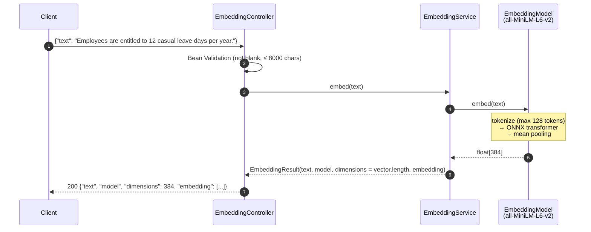
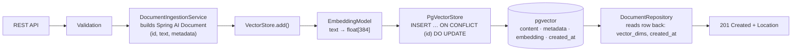
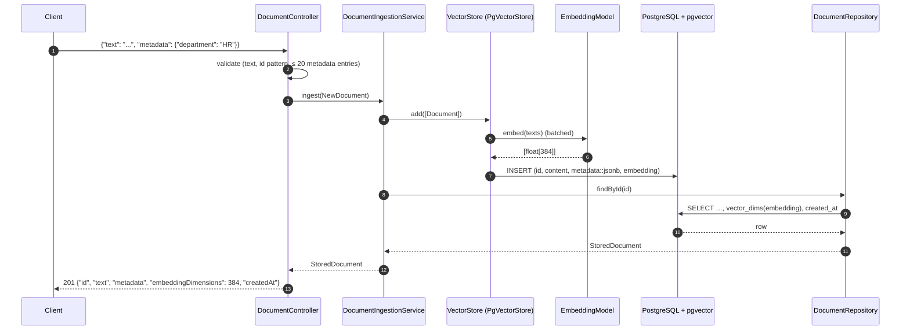

# Embedding and ingestion flow

## 1. Generate an embedding (nothing stored)

`POST /api/embeddings`

`dimensions` is the length of the vector the model actually returned, not a configured constant.

## 2. Ingest a document (text + metadata + vector → pgvector)

`POST /api/documents` (single) or `POST /api/documents/batch` (one batched model call)

## Key points

- **Our service never calls the embedding model during ingestion.** `VectorStore.add()` does it. The vector store
  abstraction is "embedding-aware"; the database is not.
- **Upsert by id.** Re-sending the same id replaces text, metadata and vector, and `created_at` keeps its first value.
  This makes the sample dataset safe to load repeatedly.
- **Failure mapping:** a database error → `503 Vector store unavailable`; anything else during `add()` comes from
  the embedding step → `503 Embedding provider unavailable`. Clients never see provider messages.
- **What is logged:** count, total characters, model, latency. Never the text.
