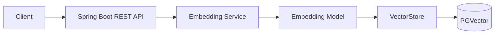
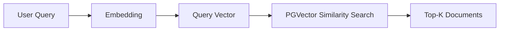
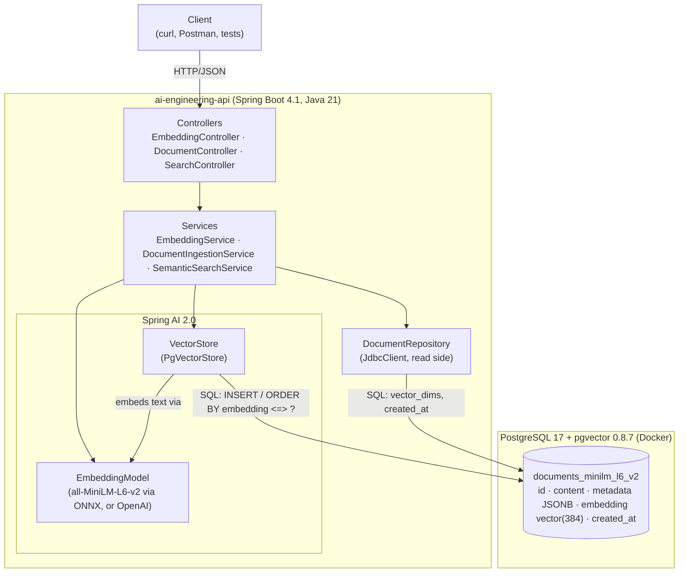

# Architecture overview (milestone 1)

A single Spring Boot service (modular monolith) plus one PostgreSQL + pgvector container. No LLM.

## The 10-second version (interview whiteboard)





## Components



## Who is responsible for what

```text
Spring Boot ─▶ Spring AI ─▶ EmbeddingModel ─▶ VectorStore ─▶ pgvector
```

| Component | Responsibility | Does NOT do |
|---|---|---|
| **Spring Boot** | HTTP, validation, configuration, dependency injection, Actuator, Flyway | anything AI-specific |
| **Spring AI** | portable abstractions (`EmbeddingModel`, `VectorStore`, `Document`, `SearchRequest`, filter expressions) and auto-configuration that picks the implementation from properties | hold data or run models itself |
| **EmbeddingModel** | text → `float[]`. The *only* component that understands language | store anything |
| **VectorStore** (`PgVectorStore`) | glue: calls the `EmbeddingModel`, writes text + metadata + vector, translates `SearchRequest` and filters into SQL, maps rows back into `Document`s with a score | understand meaning, or choose the model |
| **pgvector** | stores `vector(384)`, computes distances (`<=>`), indexes them (HNSW) | create vectors or know what they mean |
| **Our code** | API contract, validation, error mapping, metrics, logging policy, reading stored rows back | depend on a concrete model or store in the service layer |

## Packages

```text
com.aiengineeringlab.api
├── controller/        HTTP endpoints + request DTOs (validation)
├── service/           use cases: embed, compare, ingest, search
├── repository/        plain-SQL read access to the vector table
├── domain/            records returned by services (and serialised as responses)
├── configuration/     embedding properties, startup dimension check, /actuator/info
└── exception/         exception types + RFC 9457 problem-detail mapping
```

## Flows

- [Embedding and ingestion flow](embedding-flow.md)
- [Vector search flow](vector-search-flow.md)
- [Security: local vs. production](security.md)
- [Observability](observability.md)
