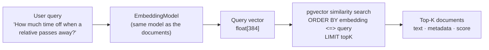
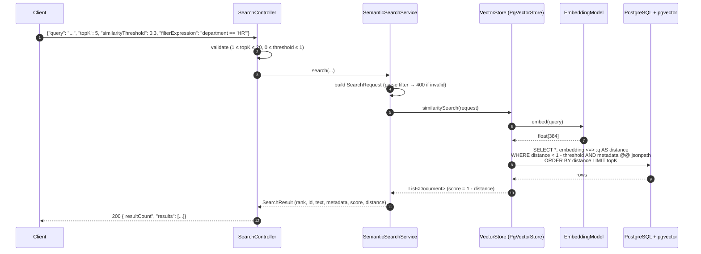

# Vector search flow

`POST /api/search`, pure vector retrieval with no LLM.

## Parameters and what they really do

| Parameter | Effect | Watch out |
|---|---|---|
| `topK` (default 5, max 20) | `LIMIT` on the nearest neighbours | always returns K rows if available, relevant or not |
| `similarityThreshold` (default 0) | `WHERE distance < 1 - threshold` | 0 still drops documents with negative similarity |
| `filterExpression` | Spring AI portable filter → `metadata @@ '$.department == "HR"'` | filter + approximate index can yield fewer than K results |

## Score vs. distance

- `distance` = cosine distance from pgvector's `<=>`: 0 = same direction, 1 = unrelated, 2 = opposite.
- `score` = `1 - distance` = cosine similarity. Higher is better.
- Scores are **model-specific** and **not probabilities**. In our evaluation a correct match scored 0.35 and a wrong one 0.57.

## Why no LLM here

The output is a ranked list of existing texts. Nothing is generated, so nothing can be hallucinated. That makes retrieval
quality measurable on its own, which RAG (milestone 3) depends on.
